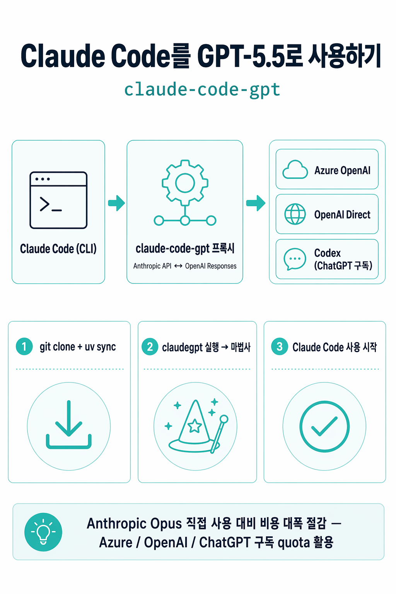

# claude-code-gpt

> Run [Claude Code](https://docs.claude.com/en/docs/claude-code/overview) with **GPT-5.5** as the backend — through Azure OpenAI, OpenAI direct, or your existing Codex CLI session.
>
> [한국어 README](README.ko.md)

A tiny FastAPI proxy that translates Anthropic's Messages API into the OpenAI **Responses API**. Point Claude Code's `ANTHROPIC_BASE_URL` at it and the entire CLI keeps working — same UX, same tools, same sub‑agents — just running on GPT-5.5 instead of Claude.

<p align="center">
  
</p>

```
Claude Code  ──►  claude-code-gpt  ──►  Azure / OpenAI / Codex
   (UX)            (this repo)          (cheaper compute)
```

---

## Why

Same Claude Code workflow, with the option to point at cheaper backends. From a single internal run on the same task (a small Pygame demo, sub‑agent enabled, sonnet tier × sonnet tier):

| Backend | Approx. spend on that one run |
| --- | ---: |
| Azure GPT‑5.5 via this proxy | ~$4 |
| Azure GPT‑5.4‑mini via this proxy | **~$0.43** |

Anthropic Opus on the same task would have been several times more expensive. We're not publishing apples‑to‑apples benchmarks — your mileage will vary heavily by task, prompt size, and sub‑agent fan‑out. Treat this as a rough proof that the proxy actually works, not a marketing claim.

---

## Quick start

```bash
git clone https://github.com/gh777111/claude-code-gpt
cd claude-code-gpt
uv sync                       # installs fastapi/uvicorn/httpx/python-dotenv

mkdir -p ~/.local/bin
ln -sf "$PWD/claudegpt" ~/.local/bin/claudegpt
# make sure ~/.local/bin is on your PATH

claudegpt                     # first run launches a setup wizard
```

The wizard asks which backend to use (Azure / OpenAI / Codex) and writes a `.env` for you. For Codex it just shells out to `codex login` — no API key to copy/paste. After that, every `claudegpt` invocation boots the proxy and execs Claude Code.

Requirements:

- macOS / Linux
- Python 3.12+
- [`uv`](https://docs.astral.sh/uv/) (`pip install -e .` also works)
- [Claude Code](https://docs.claude.com/en/docs/claude-code/overview) installed
- Credentials for at least one supported backend (see below)

---

## Backends

Set `CLAUDEGPT_PROVIDER` in `.env`.

### `azure` *(recommended for production)*
Uses your Azure OpenAI resource. Bring your own deployments:

```bash
CLAUDEGPT_PROVIDER=azure
AZURE_OPENAI_ENDPOINT=https://YOUR-RESOURCE.cognitiveservices.azure.com/
AZURE_OPENAI_API_KEY=...
AZURE_OPENAI_CHAT_DEPLOYMENT_FULL=gpt-5-5      # → claude-opus-*
AZURE_OPENAI_CHAT_DEPLOYMENT=gpt-54-mini       # → claude-sonnet-*
AZURE_OPENAI_CHAT_DEPLOYMENT_NANO=gpt-54-nano  # → claude-haiku-*
```

### `openai`
Uses the public OpenAI API with your `OPENAI_API_KEY`:

```bash
CLAUDEGPT_PROVIDER=openai
OPENAI_API_KEY=sk-...
CLAUDEGPT_OPENAI_OPUS=gpt-5.5
CLAUDEGPT_OPENAI_SONNET=gpt-5.4-mini
```

### `codex` *(experimental)*
Reads the local Codex CLI session at `~/.codex/auth.json` and forwards requests to the same backend the Codex CLI uses. Subject to whatever rate limits / quotas your account has there. May break at any time when the upstream changes — treat as a curiosity, not a contract.

```bash
CLAUDEGPT_PROVIDER=codex
# ~/.codex/auth.json must already exist (run `codex login` first)
```

---

## Model mapping

When Claude Code asks for `claude-opus-*` / `claude-sonnet-*` / `claude-haiku-*`, the proxy routes to your configured model per tier. Defaults:

| Claude tier | azure | openai | codex |
| --- | --- | --- | --- |
| opus | `gpt-5-5` | `gpt-5.5` | `gpt-5.5` |
| sonnet | `gpt-54-mini` | `gpt-5.4-mini` | `gpt-5.4-mini` |
| haiku | `gpt-54-nano` | `gpt-5.4-mini` | `gpt-5.4-mini` |

Override any of them via `.env`.

### Reasoning effort

GPT‑5 series is a reasoning family. Effort per tier (default `medium`) is configurable; tool‑bearing turns are automatically shifted down to `low` to keep agentic latency reasonable:

```bash
CLAUDEGPT_REASONING_OPUS=medium
CLAUDEGPT_REASONING_SONNET=medium
CLAUDEGPT_REASONING_HAIKU=medium
CLAUDEGPT_TOOLS_REASONING=low
```

---

## How it works

```
Claude Code
   │
   │  POST /v1/messages   (Anthropic Messages API + SSE)
   ▼
claude-code-gpt  ── translate ──►  POST /v1/responses   (OpenAI Responses API)
   ▲                                  │
   │  Anthropic-style SSE             │  Responses SSE (response.output_text.delta, etc.)
   └──────────── translate ◄──────────┘
```

Key implementation choices:

- **Responses API**, not chat/completions — required for `reasoning_effort` + tools simultaneously, plus better stream semantics.
- **Tool args buffered + cleaned** — empty optional parameters (e.g. Read's `pages`) are stripped before reaching Claude Code, fixing the most common "tool call rejected" loop.
- **Global config isolation** — by default the launcher exports `CLAUDE_CONFIG_DIR=/tmp/claudegpt-clean-config` so Claude Code skips your global `~/.claude/` (CLAUDE.md, MCP, skills, agents). This alone cut our system‑prompt overhead from ~20k to ~6.6k tokens. Disable with `CLAUDEGPT_GLOBAL_ISOLATE=0` if you want your global setup back.
- **Cost‑cutting envs** — `DISABLE_NON_ESSENTIAL_MODEL_CALLS=1`, `DISABLE_AUTOCOMPACT=1`, `MAX_THINKING_TOKENS=0` exported by the launcher.

---

## Limitations

- **Anthropic-only features that don't translate cleanly:** prompt caching with `cache_control` markers, extended thinking blocks, and some fine-grained MCP behaviors. We don't claim parity, just usability.
- **Built-in WebSearch / WebFetch** are not faked — Claude Code's server-side web tools are Anthropic's, not ours. Use a `crawlee` or Brave‑Search MCP instead.
- **The model will insist it is Claude** when you ask. That's just how strongly it follows the Claude Code system prompt; the routing logs and your provider's billing dashboard are the real source of truth.
- **You are responsible for ToS** — using Claude Code with a non‑Anthropic backend is your call. Same for any backend.

---

## File layout

```
claude-code-gpt/
├── claudegpt          # bash launcher: boots proxy, exports envs, execs `claude`
├── server.py          # FastAPI app, provider dispatch, SSE collect-to-json
├── translate.py       # Anthropic Messages ↔ OpenAI Responses input/output
├── stream.py          # Responses SSE → Anthropic SSE
├── config.py          # env loading + model + reasoning_effort mapping
├── pyproject.toml     # fastapi / uvicorn / httpx / python-dotenv
└── .env.example
```

Four real source files. No framework lock‑in.

---

## License

MIT — see [LICENSE](LICENSE).

Inspired by [aattaran/deepclaude](https://github.com/aattaran/deepclaude) (Claude Code → DeepSeek). Not affiliated with Anthropic, OpenAI, or Microsoft.
